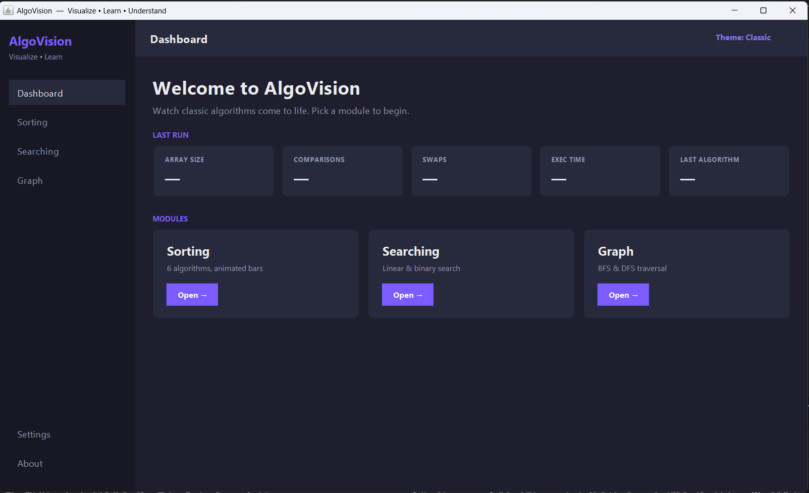
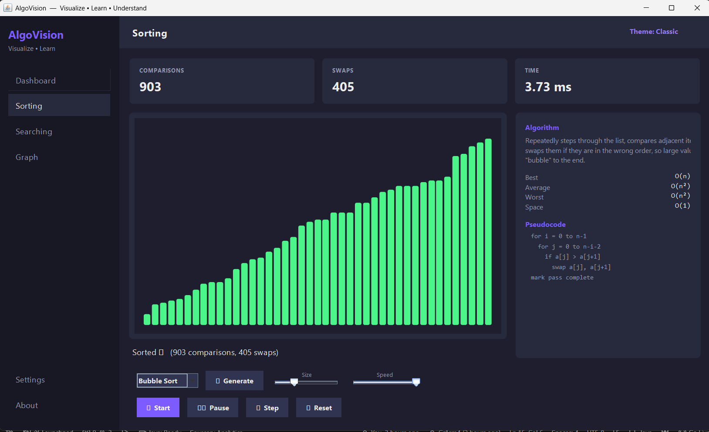
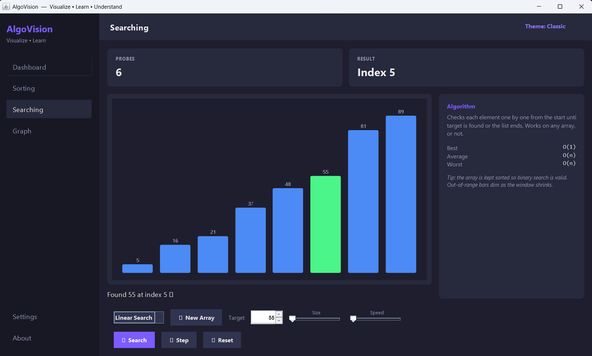
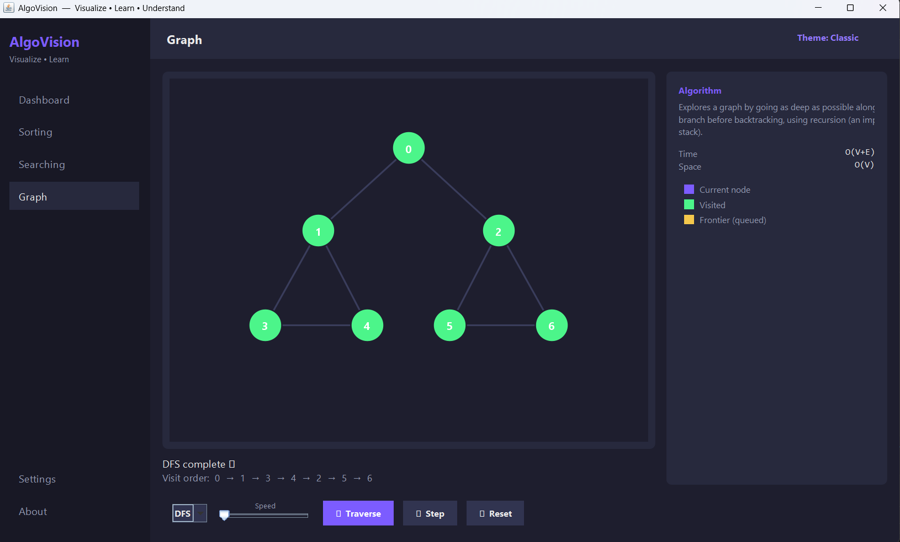

# AlgoVision — Algorithm Visualizer

> Visualize • Learn • Understand

A modern Java Swing desktop application that animates how core Data Structures
and Algorithms work, step by step — with live statistics, complexity analysis,
pseudocode highlighting, and plain-English explanations. Built with **no external
libraries**: pure Java 17+, Swing and Java2D.

## Features
- **Dashboard** — at-a-glance stats from your last run (array size, comparisons, swaps,
  execution time, last algorithm) plus quick-launch cards into each module.
- **Sorting visualizer** — Bubble, Selection, Insertion, Merge, Quick and Heap sort,
  animated bar by bar with color-coded states (comparing / swapping / pivot / sorted).
- **Searching visualizer** — Linear and Binary search on a sorted array; the search
  window dims out-of-range bars so binary search is easy to follow.
- **Graph visualizer** — Breadth-First and Depth-First Search animated over a fixed
  graph, with current / frontier / visited node coloring.
- **Controls** — generate random arrays, array-size slider, animation-speed slider,
  start / pause / resume / next-step / reset.
- **Live panels** — algorithm definition, highlighted pseudocode, and a complexity
  table with running comparison/swap counts.
- **Working settings** — switch the bar color scheme (Classic / Ocean / Sunset) with a
  live preview, and set default array size & animation speed.
- **Modern UI** — dark theme, rounded cards & buttons, sidebar navigation, hover effects.

## Architecture
A clean, layered design (Single Responsibility throughout):

```
model/     immutable data carriers (AlgorithmStep, AlgorithmInfo, AppState, StepType)
service/   the algorithm "engines" that record animation steps (Sorting/Searching/Graph)
util/      shared helpers (ColorPalette, UIHelper)
ui/        all Swing screens & components (MainFrame, BarCanvas, GraphCanvas, panels)
Main.java  entry point (launches the UI on the Event Dispatch Thread)
```
## 📸 Application Screenshots

### 🏠 Dashboard



---

### 📊 Sorting Visualizer



---

### 🔍 Searching Visualizer



---

### 🌐 Graph Visualizer



The key design idea: algorithms **record** a list of `AlgorithmStep` snapshots, and
the UI simply **replays** them with a `javax.swing.Timer`. This cleanly separates
algorithm logic from rendering, and makes pause/resume/step/stop trivial.

## How to run
Requires JDK 17 or newer.

```bash
cd src
javac -d ../out Main.java model/*.java service/*.java util/*.java ui/*.java
java -cp ../out Main
```
Or open the folder in IntelliJ / VS Code, mark `src` as the sources root, and run `Main`.

## Roadmap
- [x] Application shell (sidebar, top bar, switchable content)
- [x] Dashboard with live last-run statistics
- [x] Sorting visualizer (6 algorithms) with controls, stats, code & complexity panels
- [x] Searching visualizer (Linear, Binary)
- [x] Graph algorithms (BFS, DFS)
- [x] Working settings (bar color scheme, default size & speed)
- [ ] Full app-wide theme switching (dark / light / blue surfaces)
- [ ] Save visualization as image / screenshot
- [ ] Future scope: AVL, Red-Black, Dijkstra, A*, maze solver, DP visualizations

## License
MIT (or your choice).
